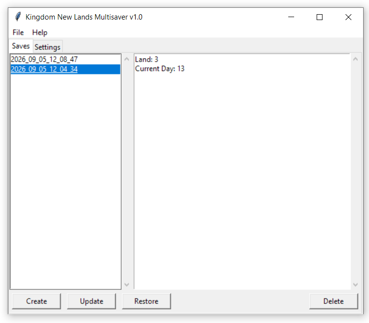
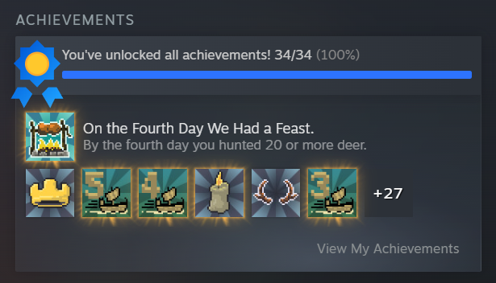

## Kingdom New Lands Multisaver

Kingdom New Lands Multisaver is a small tool that makes it easier to unlock
achievements in *Kingdom: New Lands* by creating and restoring multiple game
saves.

### Before using

- Disable Steam Cloud synchronization for *Kingdom: New Lands*. Otherwise,
  Steam may overwrite the local save files.
- Close the game before restoring a save. Restoring while the game is running
  may not work correctly or may cause the restored save to be overwritten.

The application uses the game's local save files and lets you create backups,
add comments to them, and restore a selected backup when needed.

### Screenshots

### Author

[S4NTY](https://github.com/S4NTY)